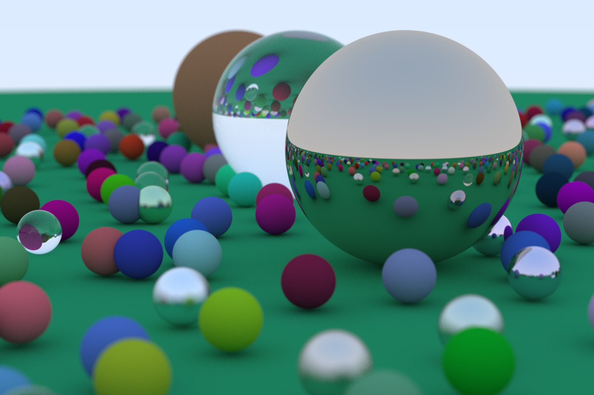

#### This Repo is an implementation of a RayTracer using the information from the book by *Peter Shirley* named: **RayTracing In One Weekend** 

#### This Implementation follows a minimal apporach with C++, With only using operator overloading as a dintinctive feature of C++. As a result, the program is 2X faster (half the time) when running the final render.

You can compile and run the program by running the `build.sh` file.

